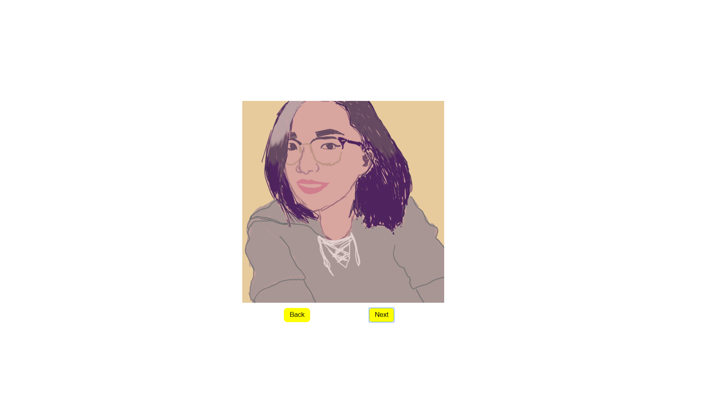

# 🎠Simple Image Carousel

Rotates through images using a next and back button.
**Link to Project:** https://hubberttaye.github.io/ImageCarousel/

## How it's Made:

**Languages used:** HTML5, CSS3, and jquery

Added an event listener onto the back and next button which then moves down or up an array of pictures respectively. Used .attribute method to update the source tag on my image element to change the pictures in the DOM.  

## Lessons Learned:

Learned how to create a loop in an array for display without using a for loop and the method .attr updates an attribute added to an element.
